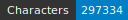
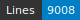

HTRomance: Corpus ???
=====================
   

<!-- Custom Zone -->

## Introduction

## Credits

<!-- Rien ne doit être modifié manuellement après la balise Start Auto -->

<!-- Start Auto -->

## Transcription guidelines

The transcription guidelines are described in a paper available on [HAL](https://hal-enc.archives-ouvertes.fr/hal-03828353) and published at the Journal for Open Humanities Data. It provides specific details about the selection process, the transcription methods and choices, as well as details about output (mainly the [Generic CREMMA Model for Medieval Manuscripts (Latin and Old French)](https://zenodo.org/record/7234166#.Y7f69afMJhE) for [Kraken](https://kraken.re))

## Data

ALTO and images can be found in the directory data. Each subfolder of data corresponds to a 
single manuscript, identified by its bookshelf.

<!-- BeginTable -->

| Shelfmark                                                         | Folder                                   | Biblissima   | Range     | Type   |   Century | Color   |   Main Zones |   Lines |   Characters | Genre   | Content                       |
|-------------------------------------------------------------------|------------------------------------------|--------------|-----------|--------|-----------|---------|--------------|---------|--------------|---------|-------------------------------|
| [BnF Latin 7720](https://gallica.bnf.fr/ark:/12148/btv1b8446940n) | [🔗](medieval-latin/data/bnf-latin-7720) |              | 100v-102v | prose  |        14 | ✓       |           10 |     580 |        13711 | prose   | Quintilien, Inst. 11.2.44 seq |

<!-- EndTable -->

## Metrics

<!-- StartMetric -->

### Regions

- MarginTextZone (57)
- MainZone (10)
- RunningTitleZone (3)
- DropCapitalZone (1)
- GraphicZone (5)
- NumberingZone (5)

### Lines

- DefaultLine (574)
- HeadingLine (6)

<!-- EndMetric -->

## Funding

This project was funded by the Bibliothèque nationale de France through the 2022 project calls from
[Datalab](https://www.bnf.fr/fr/bnf-datalab).

## Citer le projet

ToDo.

## Infrastructure

This project was produced through the [CREMMA infrastructure](https://www.dim-map.fr/projets-soutenus/cremma/).

